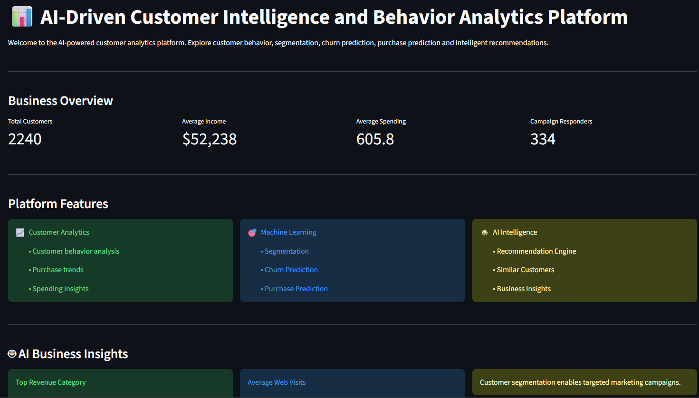
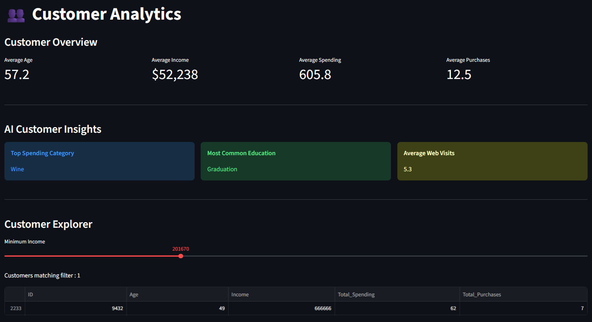
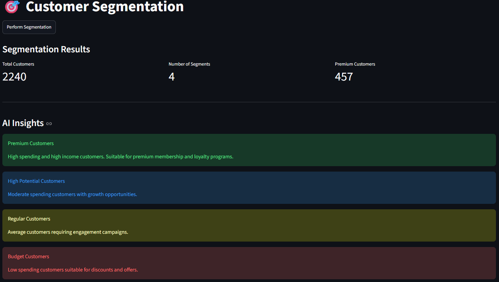
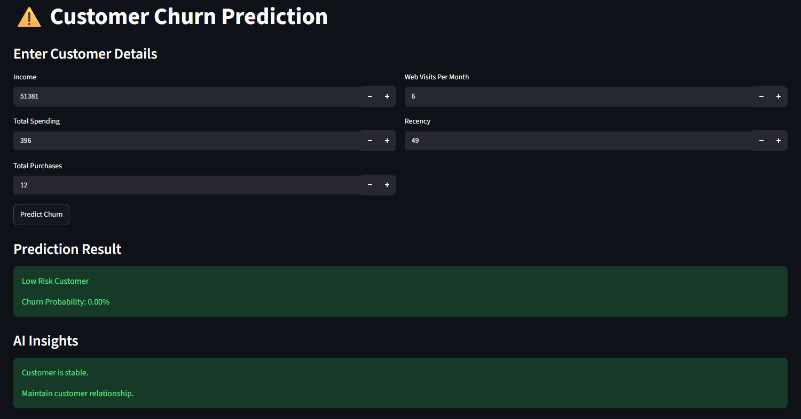
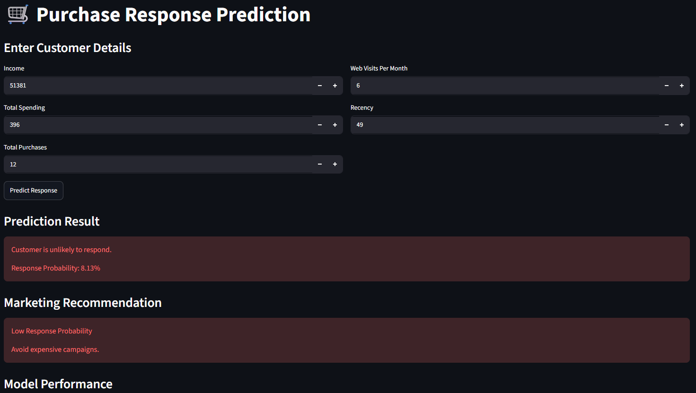
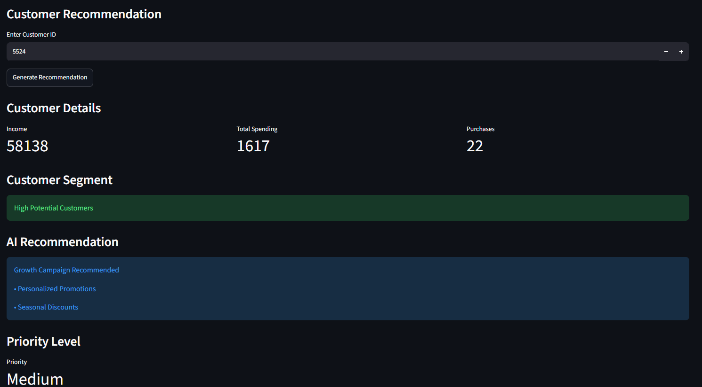
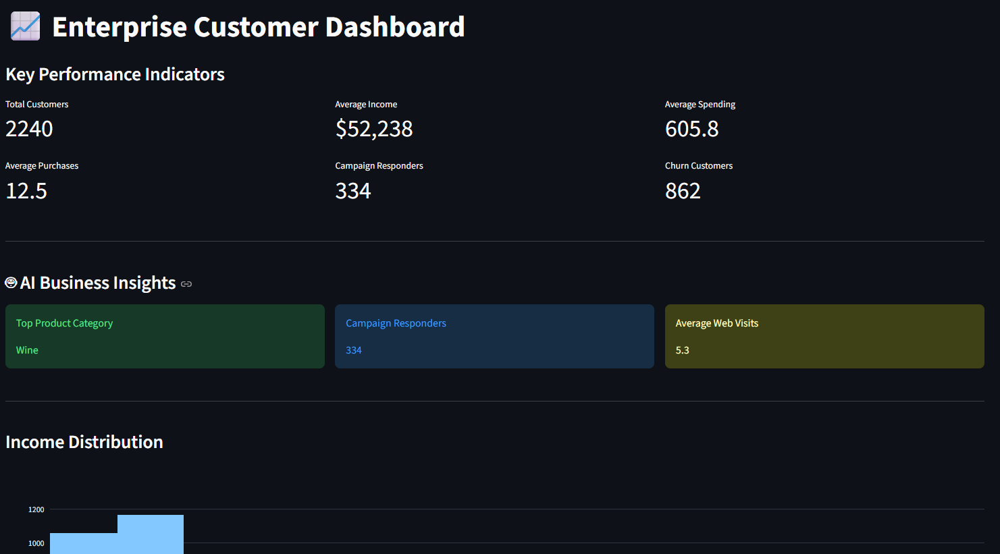

# 📊 AI-Driven Customer Intelligence and Behavior Analytics Platform

An AI-powered customer analytics platform built using Streamlit and Machine Learning to analyze customer behavior, identify customer segments, predict churn, predict campaign response, and generate intelligent recommendations.

---

# 🚀 Features

### 📈 Data Analysis

* Dataset overview
* Missing value analysis
* Statistical summary
* Correlation heatmap
* Interactive visualizations

### 👥 Customer Analytics

* Customer demographics analysis
* Income analysis
* Spending analysis
* Purchase behavior analysis
* Customer insights

### 🎯 Customer Segmentation

* K-Means clustering
* Segment identification
* Premium customer detection
* Segment statistics
* Business insights

### ⚠️ Churn Prediction

* Random Forest model
* Customer risk prediction
* Churn probability estimation
* Feature importance analysis
* Model evaluation metrics

### 🛒 Purchase Prediction

* Logistic Regression model
* Campaign response prediction
* Response probability analysis
* Marketing recommendations

### 🤖 Recommendation Engine

* Personalized customer recommendations
* Similar customer identification
* Priority level analysis
* Segment-based suggestions

### 📊 Enterprise Dashboard

* KPI cards
* AI business insights
* Product category analysis
* Campaign response analysis
* Customer overview

---

# 🛠️ Technologies Used

### Frontend

* Streamlit

### Data Processing

* Pandas
* NumPy

### Machine Learning

* Scikit-Learn

### Visualization

* Plotly
* Matplotlib
* Seaborn

---

# 🤖 Machine Learning Algorithms

| Module                | Algorithm           |
| --------------------- | ------------------- |
| Customer Segmentation | K-Means Clustering  |
| Churn Prediction      | Random Forest       |
| Purchase Prediction   | Logistic Regression |

---

# 📂 Project Structure

```text
AI_Customer_Analytics/
│
├── app.py
│
├── dataset/
│   └── marketing_campaign.csv
│
├── pages/
│   ├── 1_Data_Analysis.py
│   ├── 2_Customer_Analytics.py
│   ├── 3_Segmentation.py
│   ├── 4_Churn_Prediction.py
│   ├── 5_Purchase_Prediction.py
│   ├── 6_Recommendations.py
│   └── 7_Dashboard.py
│
├── models/
│   ├── segmentation.py
│   ├── churn.py
│   └── purchase.py
│
├── utils/
│   ├── data_loader.py
│   └── preprocessing.py
│
├── outputs/
├── assets/
├── requirements.txt
└── README.md
```

---

# 📁 Dataset

**Customer Personality Analysis Dataset**

* Total Customers: 2240
* Source: Kaggle
* Type: Customer Behavior Dataset

---

# 📋 Modules

* Home
* Data Analysis
* Customer Analytics
* Customer Segmentation
* Churn Prediction
* Purchase Prediction
* Recommendation Engine
* Enterprise Dashboard

---

# 📊 Key Features

* Interactive dashboards
* AI business insights
* Customer segmentation
* Churn prediction
* Purchase prediction
* Recommendation engine
* Similar customer finder
* KPI cards
* Professional visualizations

---

# ▶️ Installation

### Create Virtual Environment

```bash
py -3.11 -m venv venv
```

### Activate Environment

```bash
venv\Scripts\activate
```

### Install Dependencies

```bash
pip install -r requirements.txt
```

---

# ▶️ Run Application

```bash
streamlit run app.py
```

---

# 📷 Output

### Home Page

<p align="center">
  
</p>

### Customer Analytics

<p align="center">
  
</p>

### Customer Segmentation

<p align="center">
  
</p>

### Churn Prediction

<p align="center">
  
</p>

### Purchase Prediction

<p align="center">
  
</p>

### Recommendation Engine

<p align="center">
  
</p>

### Enterprise Dashboard

<p align="center">
  
</p>

---

# 🎓 Academic Information

**Final Year Major Project**

Department of Artificial Intelligence and Machine Learning

---

## Developed Using

* Streamlit
* Python
* Machine Learning
* Data Analytics
